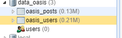
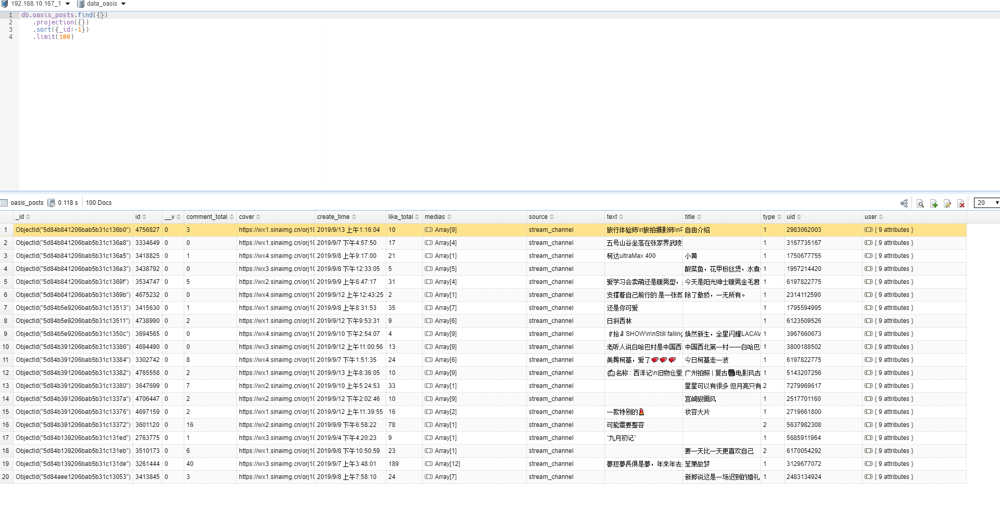
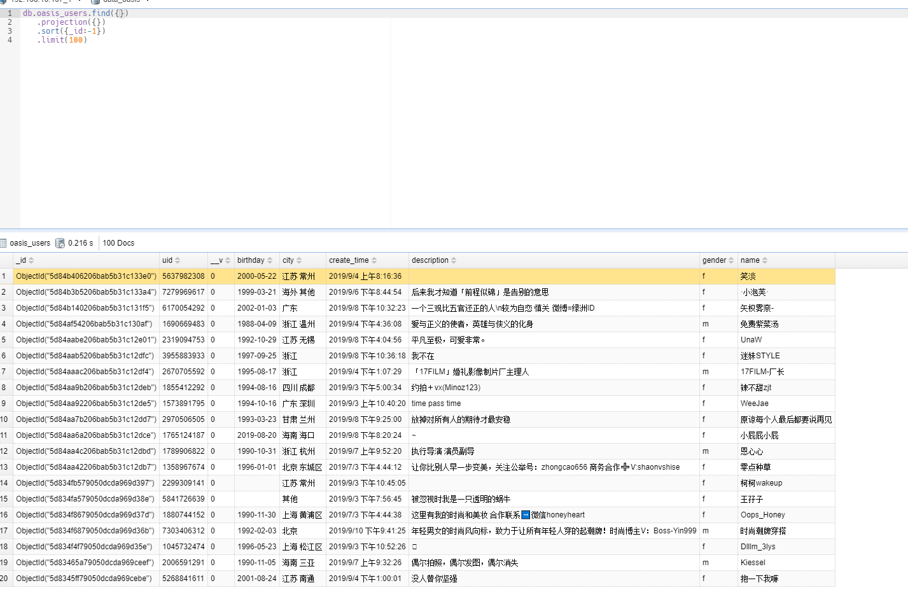

## 绿洲1.4.2签名算法






``` javascript 
const star = new Oasis.Account();
const logger = Core.Logger.logger();
star.accessToken = "xx";
star.cuid = "xx";
//调用其他API
//上面可使用登录发送短信API
```

授权协议：只允许研究、学习目的的分享、使用、修改，不允许任何商业用途。转载请注明出处，感谢。